## The Complete Transaction Lifecycle

Meridian handles the full journey of every financial transaction: recording positions, calculating values, and executing settlements. Three words capture what we do: **Measure. Value. Settle.**

---

## Core Capabilities

### Position Recording

Every transaction enters the system with a complete record of what happened, when, and why. Positions are tracked from initiation through completion, with full lineage showing how transactions relate to each other.

Parent-child relationships between transactions are preserved. Batch imports handle thousands of records. Nothing is lost, nothing is overwritten.

### Double-Entry Accounting

Every movement of value is recorded as balanced debits and credits. The system enforces the fundamental accounting equation - the books always balance.

Posting status moves through a clear lifecycle: pending, posted, or reversed. Each transition is recorded. Auditors can trace any figure back to its source transactions.

### Safe Payment Execution

Before money moves, funds are reserved. A payment doesn't debit your account immediately - it places a hold (a lien) that guarantees the funds are available.

If the payment succeeds, the lien converts to a debit. If it fails, the lien releases automatically. No orphaned debits. No overdrafts from race conditions. No manual cleanup.

### Multi-Asset Support

Meridian isn't limited to currency. The same ledger infrastructure handles:

- **Fiat currency** - GBP, USD, EUR with proper decimal handling
- **Energy** - kWh positions with time-of-use tariff valuation
- **Commodities** - Physical goods with market price valuation
- **Carbon credits** - Environmental assets with exchange pricing
- **Custom assets** - Define your own asset types without code changes

Each asset type carries proper dimensional typing. You can't accidentally add pounds to kilowatt-hours.

### Flexible Organisation Structure

A single deployment serves multiple divisions, subsidiaries, or programmes. Each organisation operates with complete data isolation.

Account 123 in Organisation A is entirely separate from Account 123 in Organisation B. Same infrastructure, different contexts. Transferring between organisations requires proper external settlement - there's no backdoor.

Deploy on-premises with a single cluster under your control. Your organisation structure reflects your business, not our architecture.

---

## How It Works Together

A typical payment flows through the system:

```mermaid
sequenceDiagram
    participant Client as Your System
    participant Meridian as Meridian
    participant Bank as Payment Network

    Client->>Meridian: 1. Initiate Payment
    Note over Meridian: Validate & Reserve Funds
    Meridian->>Meridian: 2. Record Position
    Meridian->>Bank: 3. Execute Payment
    Bank-->>Meridian: Confirmation
    Meridian->>Meridian: 4. Post to Ledger
    Meridian-->>Client: 5. Complete ✓

    Note over Client,Bank: If anything fails, automatic rollback
```

1. **Initiate** - Payment request received with idempotency guarantee
2. **Reserve** - Funds held via lien, available balance reduced
3. **Record** - Position logged with full audit context
4. **Execute** - External settlement via payment gateway
5. **Post** - Ledger entries created as balanced debits and credits
6. **Complete** - Lien converted, final balances updated

If anything fails, automatic compensation unwinds the transaction. Liens release. Positions reverse. The system returns to a consistent state.

---

## Enterprise Integration

### BIAN Standards

Meridian follows Banking Industry Architecture Network (BIAN) service domain patterns. The same architectural language used by major global banks structures our services.

This isn't arbitrary design. BIAN provides proven boundaries between account management, position keeping, financial accounting, and payment processing.

### ISO 20022 Ready

External message formats connect through an adapter layer. SEPA, SWIFT, Faster Payments - the internal model stays clean while supporting the message standards your partners expect.

### API-First

Every operation available via REST and gRPC. OpenAPI documentation generated from the same source as the implementation. The API is the product.

---

## Operational Characteristics

### Audit Everything

Every change captures who made it, when, what the old value was, and what the new value is. Audit records are written in the same database transaction as the business operation - they can't be lost even if the application crashes mid-operation.

### Idempotent Operations

Retry any request safely. The same payment initiation sent twice produces the same result once. Critical for unreliable networks and at-least-once message delivery.

### Observable

OpenTelemetry tracing, Prometheus metrics, structured logging. Follow a transaction through every service. Know when something is wrong before your customers do.

### Cloud-Native

Kubernetes deployment. Horizontal scaling. Database-per-service isolation. The patterns that work at scale, available from day one.

---

## Open Source

Inspect every line of code. Understand exactly how your financial data is handled. Contribute improvements. No black boxes.

[View on GitHub](https://github.com/meridianhub/meridian)
